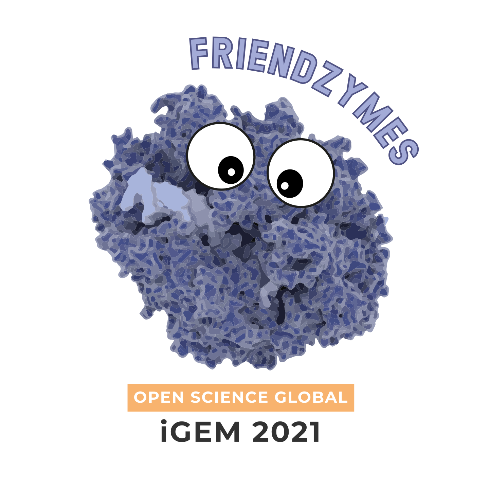

   
  
   

# friendzymes-cookbook [![Friendzymes Cookbook](https://img.shields.io/static/v1?label=friendzymes%20cookbook&message=cookbook-home&labelColor=F8F1EF&color=FF8552&style=for-the-badge&logo=data:image/png;base64,iVBORw0KGgoAAAANSUhEUgAAADAAAAAwCAYAAABXAvmHAAAAAXNSR0IArs4c6QAABQ9JREFUaEPtmG1MU1cYx//nkirUIa5x+AKOoWQjLjhxLO4lS/jAXNSY7MN0GwS9haRl0Ftlzi+LEadzmRrfWoG2GntRsyzKXJYZnbJkzGwwiMiLMRku6KKbLxWQKTitvfcst1LXGem5195iTHqSJs09z/0//995ntPTewme8EGecP+IAzzuCsYrEK9AlCugSwvx/LYJMHCLZHC9e3cJR6P0pOn2RwYwl1dPo5LsADBh+DM7mJnSPaLHXvqgC7PV+R4FlhKC7oSAtHH37hVXNTkdIfiRAXirYz9Aih6mS4C9FGQ/KL0CjrxPKZ1HgLxQLAE8XrdgfWwARYJjvMGP8wAxhZs41320Zcvm9Qlnz55NbWg4nnbgwNeBJcUbxj7MqESljH2eFReihdBUAb7MwQNSI5CQD0q84clzc8Z12yvML4RfW7duHQ5929yb+8rCiaHrJxq249atW7jjR8v1/suvjhoAb915HqDPjZSwepulzZg05uUH5+fPn4/JGQuDl3NnyrDb7cHvXV1dQ8XFJRdz55rfrdtlO/OoIKoqwFudtQDKIiXZ/Hlh50ST6SUlpqenp2nLlq0JNTXVc202G4YC2f8zH9Lp6Oi4umn7kUljE8efA0Gb6BKWaAVhAvBlznxQ/MgSnjnjbveqVZXBFsrJmfVXVlZWb1FR4fXDhw/nN544daO97Sc5OTn5rt/v9xuNxrSQXuXK9Z0DQ08HwUFwUCsEE2BpWW0aRwN/sgD27a5Ea2vLD3PmzClYvXr1kfr6+lmFhYXp5y+Z0N763UDHqWMTUlMnX+zv75s2OHizJzExcYai+ckaR+dlH3cPAIAsY4GWs4QJoIjy1p1egPIsiJam+r8z0owp2dnZOH36NPoGDP/MzluQpNznddlQVfXpLxs2fPZGX1/vyZSUlDyfz9curHRNNY4zTQrTrhDdQg0rV2ieCVBautUkGQwuUCxWK/qwuKGb/Zfeyk/3Z2Y+21FQUPCOz3etx175xe2k5MwX78cTXCIGOtvrtF9TmysiwDKLYx7hiBcUU9UKRoqTZckfuHPld+muRAcGbydNmfp8sI3Ch9ZDLiIAb3UKAJS/C6M+RLfA7I57+z7CMFsdH1CQL0fdfdAZNYsuu8jKHRGgpGRjsmww3mCJxGae/CG6bZksbWaZeKtTOQPyWUKxmFfTRpH3gMpDLBbmQUmb6LHd/wc7Uo7Ie0BwPEP9xBcTgwxRSrGtziN8xMrNbKHS8uosKUDXgNBilpie8wRo9rqF11maTICQAG9xVoFgLUtQz/mo90C4GXOZ821K8b2eBllaah56VFdASbbM6mwiwGusxHrNc5R7c4+n4udIetoALA47IWSHXgZH0qHAN4TKXaJnObNlNQEUl9WmJlCpGaDTYweh7gAL5dcEoNw0/HrkKwCNsTngYgwQ3AsWx4w6j72HtzppDCpxQXQLGWp1NVcgXJi3ODpByCy1ydTEEUIFr8u+U02sEhMlwI61IFyV2mRhfdtMqXwchGQBZPj5mNwEoVtFl6C0puoRFYDF4p7iJ/5DAB58v6O8JvnvSWvYjvKwInOyp652eZtqh4zAqABC2mar82MAyymQDuAMAV1CQTYBuPdCCPgVVD6m5mdRK5guAErSxeXVT42T5bwhjjt5sKZiULlW8mHNdFmSxoge4TetxtTG6wagNqHecXEAvVdUq168AlpXTO/4eAX0XlGtevEKaF0xveOf+Ar8C/HOtEAxBdcIAAAAAElFTkSuQmCC)](https://github.com/Open-Science-Global/friendzymes-cookbook)

Friendly tools for a friendly community. A collection of tutorials and genetic tools for synthetic biology.

This cookbook is a summarization of tutorials, ideas and tools that could help people beyond our own project. The repository is not only a collection of scripts for design automation but also as an Educational Tool, so newcomers in the Software Team, interested people from the Friendzymes, teams from iGEM/iGEM Design League, and others in the SynBio Community could all have a way to learn more about Poly, common problems, and how to design new tools!

## Poly

Poly is a new organism engineering library, written in the Go programming language. This package is at the core of our development process. The team relies on poly when implementing CI/CD pipelines, and we continue to enhance the core library with new features. If you're interested, we highly recommend you to take a look in [Poly repository](https://github.com/TimothyStiles/poly), and see with your own eyes this incredible piece of software!

## Actions

We are currently building a toolchain with the help of continuous integration utilities called GitHub Actions. These discrete, modular functions enable construction of larger, composite pipelines for reliable, affordable, and automated engineering of organisms. Part of the cookbook is a collection of data samples and configuration files for use with these actions, comprising:

- [codon-optimize]

codon-optimize is a Github Action that receives a path for an amino acid fasta file (faa), a codon table with the absolute frequency of each triplet in JSON format, and a path and name of an output file that will be written. This action will use the provided codon table to codon optimize a given sequence.

The cookbook contains starter materials for this action in [data/codon-optimize].

- [dna-annotate]

dna-annotate is a Github Action that receives a path for an input directory, a regex pattern that should be used to filter genbank files or another interetsing file name pattern, and a directory where the output will be written. This action will use all this information to annotate problematic parts of a given sequence.

The cookbook contains starter materials for this action in [data/dna-annotate].

- [dna-is-synthesizable]

dna-is-synthesizable is a Github Action that receives a path for an input directory, a regex pattern that should be used to filter genbank files or another interesting file name pattern, a directory where the output will be written, and also username, password, clientId and clientSecret from [Integrated DNA Technologies (IDT)][IDT] API. This action will use this information to annotate problematic parts of a given sequence.

The cookbook contains starter materials for this action in [data/dna-is-synthesizable].

## Notebooks

Part of the cookbook is a collection of Colab notebooks, currently comprising:

- [Understanding Poly][notebook-01]

Poly is our key tool for the software. It was a planned decision to build workflows that integrate with Poly, to show ways to use the package, as well as create some new features; therefore, it is very important that you understand how the Poly package works and what its structure is in general before you begin manipulating it. Thus, we created this brief overview of Poly, its sub-packages, and a collection of use cases. We strongly recommend that you do the tutorials in the order they appear.

- [Codon Optimization][notebook-02]

A very common task for the design of parts is Codon Optimization, so here we will show how you can create customized Codon Tables and how you can use this to do codon optimization of a given Coding Sequence (CDS).

- [Annotation of problematic sequences][notebook-03]

Have you designed your sequence? Now it is time to remove small forbidden parts that can hinder you, not only when sequencing (e.g. hairpins, repetitive regions), but also when cloning (e.g. restriction binding sites). What this tutorial shows is the automatic annotation of these problems. It will give you a genbank file (with these annotations attached) that you can drop into your favorite viewer, like Benchling or Snapgene.

- [CDS fix][notebook-04]

In this notebook, you will input your CDS sequence(s) and receive your CDS corrected without the problematic sequences. This is done by replacing the codons with synonymous ones, thus keeping the same amino acid sequence at the end. Kind reminder that this tutorial was NOT written for non-coding sequences such as promoters, rbs, and terminators. If you have found problematic sequences in it, review case by case and be careful not to lose biological meaning.

- [Automatically create parts with correct overhangs][notebook-05]

How about designing your final plasmid without worrying about each separate part and using a script to add the restriction binding sites, spacer, and overhangs? That’s what you find here!

- [Golden Gate Simulation][notebook-06]

In this notebook, you will run a simulation of a Golden Gate reaction and see if everything is theoretically acceptable before physically synthesizing your parts.

If you have some feature that you think will make this cookbook better, please feel free to create an issue.

---

[codon-optimize]:             <https://github.com/open-science-global/codon-optimize>
[dna-annotate]:               <https://github.com/open-science-global/dna-annotate>
[dna-is-synthesizable]:       <https://github.com/open-science-global/dna-is-synthesizable>
[IDT]:                        <https://www.idtdna.com>

[data/codon-optimize]:        ./data/codon-optimize/
[data/dna-is-synthesizable]:  ./data/dna-is-synthesizable/
[data/dna-annotate]:          ./data/dna-annotate/

[notebook-01]:                ./tutorials/01_Understanding_Poly.ipynb
[notebook-02]:                ./tutorials/02_Codon_Optimization.ipynb
[notebook-03]:                ./tutorials/03_Automatic_Annotation_Of_Problematic_Sequences.ipynb
[notebook-04]:                ./tutorials/04_Fix_CDS.ipynb
[notebook-05]:                ./tutorials/05_Create_Parts_With_Overhangs.ipynb
[notebook-06]:                ./tutorials/06_Simulate_a_Golden_Gate_simulation_for_checking_parts.ipynb
